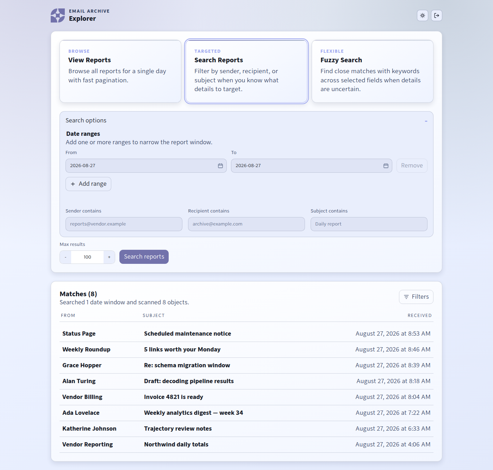

# Explorer

Explorer is a self-hosted web UI for searching an email archive stored in
Amazon S3 — the raw MIME objects that Amazon SES writes when you point a
receipt rule at an S3 bucket. If you archive mail to S3 and have no good way
to look through it, Explorer gives you date-scoped search, message rendering,
and attachment download over the archive you already own.



> **This tool reads a private email archive.** Anything Explorer can reach, a
> visitor who reaches Explorer can read. Run it behind authentication (it
> refuses every request until sign-in is configured), keep it off the public
> internet unless it is TLS-terminated and gated, and give it AWS credentials
> scoped to **read-only on one bucket prefix** — never a general-purpose key.
> See [Security posture](#security-posture).

## Features

- **Three search modes.** *View* browses a single day with cursor
  pagination; *Search* filters on sender, recipient and subject; *Fuzzy*
  scores loose keyword matches across subject, sender and — optionally —
  message bodies, with match-any or match-all semantics.
- **Multiple date windows per query.** Add several `from`/`to` ranges in one
  search instead of running the same query three times.
- **Date-partitioned S3 scanning.** Searches read only the day prefixes they
  need. See [How it works](#how-it-works).
- **Cheap header reads.** Result rows come from a ranged `GET` over the first
  64 KB of each object, so listing a day never downloads whole messages.
- **Safe HTML rendering.** Message bodies are sanitized with `bleach`;
  `<script>`/`<style>` blocks and event handlers are stripped, `data:` links
  are dropped while inline `data:` images survive, and `cid:` references are
  rewritten to Explorer's own attachment endpoint.
- **Attachment download**, including inline images referenced by
  `Content-ID` or `Content-Location`.
- **Cancellable background searches.** Long scans run in a worker thread with
  a live elapsed counter, a Cancel button, and a server-side timeout.
- **Prefix confinement.** Every S3 key Explorer touches must sit under the
  configured prefix; anything else is a 404 regardless of what the URL asks
  for.
- **Deployment-selected authentication.** Keep Elcano's existing
  Ed25519-signed magic-link cookie, or use the new central auth service with a
  per-Explorer email access list and app-scoped revocable sessions.

## How it works

SES's S3 action writes one object per message. Explorer assumes those objects
are laid out by date, which is what makes search over a large archive
affordable:

```
s3://my-email-archive/emails/2026/08/27/<message-id>
                      └───────┘ └──────┘
                       prefix    day partition
```

A naive implementation would `ListObjectsV2` the whole `emails/` prefix and
filter client-side. On an archive with hundreds of thousands of messages
that is thousands of LIST pages, on every single search, to answer a question
about one week.

Instead, Explorer expands the requested date ranges into **one prefix per
day** using `EMAIL_S3_DATE_PREFIX_FORMAT` and lists only those
(`app/s3_email.py::build_search_prefixes`). A seven-day search issues seven
narrow LISTs whose combined result set is already close to the answer. Cost
and latency then scale with the *window you asked for*, not with the size of
the archive — which is the difference between a search that returns in a
second and one that grinds for minutes and bills you for it.

Two guardrails come with that design:

- Spans wider than `EMAIL_S3_MAX_DATE_PREFIX_DAYS` (default 62) fall back to
  listing the root prefix, because at some width many narrow LISTs stop
  beating one broad one.
- Objects are still filtered by `LastModified` against the requested windows,
  so a message filed under an unexpected prefix cannot leak into a result set.

Headers for each candidate are then read with a ranged `GET` of
`EMAIL_HEADER_FETCH_BYTES` bytes (default 64 KB) — enough for the header
block, far less than a full message with attachments. Only opening a message,
or a fuzzy search that includes bodies, downloads whole objects; body search
is therefore capped separately by `EMAIL_S3_MAX_BODY_SEARCH_DAYS`.

If your archive is *not* date-partitioned, set
`EMAIL_S3_DATE_PREFIX_FORMAT=""` and Explorer will list the whole prefix
each time. It works; it is just slower and costs more.

## Quick start

Requires Python 3.11+ and read access to an S3 bucket holding SES-delivered
messages.

```bash
git clone https://github.com/ElcanoTek/explorer.git
cd explorer
python3 -m venv .venv
source .venv/bin/activate
pip install -r requirements.txt

cp .env.example .env
$EDITOR .env          # bucket, prefix, AWS credentials, authentication mode

uvicorn app.main:app --host 127.0.0.1 --port 8080
```

Then open <http://127.0.0.1:8080>. Elcano mode redirects to its existing
magic-link service. Central mode requires its configured public HTTPS origin
because its app-scoped cookie is always `Secure`. See
[Authentication](#authentication).

Run the tests with `python -m pytest -q` and the linter with
`ruff check app tests`. Neither needs AWS: `tests/` drives a fake S3 client.

## Configuration

Configuration is environment variables, read at import time by
`app/config.py`, which loads two optional dotenv files from the repository
root. Precedence, highest first:

1. `.env` — per-host values; overrides everything.
2. Whatever is already in the process environment (e.g. a systemd
   `Environment=` line, or an exported shell variable).
3. `.env.shared` — fleet-wide values; fills in only what is still unset.

Neither dotenv file is committed. `.env.example` is the annotated template:
`cp .env.example .env` and edit.

| Variable | Required | Default | Purpose |
|---|---|---|---|
| `EMAIL_S3_BUCKET` | **yes** | *(empty)* | Bucket holding the SES-written MIME objects. |
| `EMAIL_S3_PREFIX` | no | `emails/` | Key prefix for the archive. Doubles as a hard boundary: keys outside it are refused. |
| `EMAIL_S3_DATE_PREFIX_FORMAT` | no | `emails/%Y/%m/%d/` | `strftime` pattern for one day's partition. Empty string disables per-day scanning. |
| `EMAIL_S3_MAX_DATE_PREFIX_DAYS` | no | `62` | Widest span that still gets per-day prefixes; wider spans list the root prefix. |
| `EMAIL_S3_MAX_BODY_SEARCH_DAYS` | no | `14` | Cap on a body-inclusive fuzzy search, which downloads whole objects. |
| `EMAIL_HEADER_FETCH_BYTES` | no | `65536` | Bytes fetched per object by the ranged header `GET`. |
| `EMAIL_SEARCH_JOB_MAX_SECONDS` | no | `120` | Server-side cancellation for a runaway search job. |
| `AWS_REGION` | no | `us-east-2` | Region of the archive bucket. |
| `AWS_ACCESS_KEY_ID` | no | *(empty)* | Read-only key. Leave blank to use the ambient AWS credential chain (instance role, `~/.aws`, `AWS_PROFILE`). |
| `AWS_SECRET_ACCESS_KEY` | no | *(empty)* | Secret for the above. |
| `EXPLORER_AUTH_MODE` | no | `elcano` | Authentication provider: `elcano` or `central`. The default preserves existing deployments. |
| `AUTH_SIGNING_PUBKEY` | Elcano mode | *(empty)* | Base64 Ed25519 **public** key of the auth service. Unset ⇒ every request redirects to sign-in. |
| `AUTH_LOGIN_URL` | no | `https://auth.elcanotek.com` | Where unauthenticated browsers are sent. Set this. |
| `AUTH_COOKIE_NAME` | no | `elcano_auth` | Name of the session cookie to verify. |
| `AUTH_ISSUER_URL` | central mode | *(empty)* | HTTPS origin of the client's central auth service. |
| `EXPLORER_PUBLIC_URL` | central mode | *(empty)* | Explorer's HTTPS origin; its registered callback is `<origin>/auth/callback`. |
| `AUTH_CLIENT_ID` | central mode | `explorer` | Client ID registered at the auth service. |
| `AUTH_CLIENT_SECRET` | central mode | *(empty)* | Per-deployment client secret, at least 32 bytes. |
| `EXPLORER_ACCESS_DB` | central mode | `/var/lib/explorer/access.db` | Deployment-local email access list and app sessions; contains no passwords. |
| `EXPLORER_AUTH_COOKIE_SECURE` | central mode | `1` | Requires the app-scoped cookie to travel over HTTPS. Keep enabled in production. |
| `EXPLORER_UI_COOKIE_SECURE` | no | `1` | Requires the search/CSRF cookie to travel over HTTPS. Keep enabled in production. |
| `EXPLORER_SESSION_IDLE_SECONDS` | no | `3600` | Central-mode Explorer session idle lifetime (60 minutes). |
| `EXPLORER_SESSION_ABSOLUTE_SECONDS` | no | `43200` | Central-mode Explorer session absolute lifetime (12 hours). |
| `EXPLORER_SESSION_SECRET` | central: **yes**; Elcano: recommended | a dev placeholder | Signs central login state and the cookie scoping search jobs to one browser. Generate with `openssl rand -hex 32`. |

### Authentication

Set `EXPLORER_AUTH_MODE` to exactly one provider per deployment.

#### External magic-link mode

`EXPLORER_AUTH_MODE=elcano` preserves the existing behavior. Explorer verifies
a cookie minted by a separate magic-link auth service using that service's
Ed25519 **public** key:

```
base64url(payload_json) + "." + base64url(ed25519_signature)
payload = {"email": "...", "tenant": "...", "iat": ..., "exp": ...}
```

The signature covers the base64url body *string*. Any failure — no key
configured, malformed token, bad signature, expired, missing email — is
treated identically as "logged out", and the browser is redirected to
`AUTH_LOGIN_URL/?return_to=<this url>`. Because Explorer only ever holds the
public half, a compromise of an Explorer host cannot mint sessions.

Explorer ships pointed at ElcanoTek's auth service, but the format is
deliberately small: anything that mints a cookie of that shape works. If you
would rather front Explorer with your own SSO, terminate it at your reverse
proxy and keep Explorer on loopback. The verifier lives in `app/auth.py` and
its tests in `tests/test_auth.py`.

#### Central auth mode

`EXPLORER_AUTH_MODE=central` removes passwords from Explorer. An anonymous
browser starts an authorization-code flow at `AUTH_ISSUER_URL`; the request is
bound with state, nonce, and PKCE. Explorer exchanges the short-lived,
single-use code over a TLS backchannel authenticated with its client secret.
The auth service returns the authenticated account ID and email—never its
password or central session cookie.

Explorer then applies a deployment-local, default-deny email access list. An
operator controls it without creating another credential:

```bash
sudo explorer access grant user@example.com
sudo explorer access list
sudo explorer access revoke user@example.com
```

Allowed users receive a random 256-bit, app-only session. Only its SHA-256
hash is stored in `/var/lib/explorer/access.db`; the host-only
`__Host-explorer_session` cookie is `Secure`, `HttpOnly`, `SameSite=Lax`, and
scoped to `/`. Sessions expire after 60 minutes idle or 12 hours total.
Revoking an email immediately invalidates all of that email's Explorer
sessions. Logout is CSRF-protected and revokes only the current Explorer
session. Central login/logout or account disablement does not yet revoke an
already-issued Explorer session; it lasts until its idle/absolute expiry or a
local `explorer access revoke`. Back-channel revocation is a required follow-up
if clients need immediate cross-service sign-out or disablement.

The auth service must register the exact client ID, secret, and callback URL.
The expected `/authorize` and `/token` contract is documented in
[docs/DEPLOYMENT.md](docs/DEPLOYMENT.md#central-auth-service-contract).

### AWS IAM permissions

Explorer only ever lists and reads. The minimum policy, derived from the two
API calls in `app/s3_email.py` (`ListObjectsV2` and `GetObject`), scoped to a
single prefix:

```json
{
  "Version": "2012-10-17",
  "Statement": [
    {
      "Sid": "ListArchivePrefix",
      "Effect": "Allow",
      "Action": "s3:ListBucket",
      "Resource": "arn:aws:s3:::my-email-archive",
      "Condition": {
        "StringLike": { "s3:prefix": ["emails/*"] }
      }
    },
    {
      "Sid": "ReadArchiveObjects",
      "Effect": "Allow",
      "Action": "s3:GetObject",
      "Resource": "arn:aws:s3:::my-email-archive/emails/*"
    }
  ]
}
```

Substitute your bucket and prefix. Grant nothing else: no `PutObject`, no
`DeleteObject`, no bucket-wide `s3:*`. If the archive bucket is encrypted
with a customer-managed KMS key, add `kms:Decrypt` on that key.

## Deployment

[**docs/DEPLOYMENT.md**](docs/DEPLOYMENT.md) is the authoritative guide:
provisioning on Fedora/RHEL, the `explorer` service user and directory
layout, systemd units, the operator CLI, TLS via Caddy, the
attachment-cleanup timer, updates and rollback, health checks, and
troubleshooting.

The short version:

```bash
sudo git clone https://github.com/ElcanoTek/explorer.git /opt/explorer-src
sudo bash /opt/explorer-src/scripts/bootstrap.sh
```

## Security posture

- **Explorer is a window into private correspondence.** Treat its URL as
  sensitive as the mailbox itself.
- **Deny-by-default route gate.** Only health/static content and the central
  login/callback/signed-out routes are public. Every data route passes through
  the global authentication middleware.
- **Least-privilege AWS credentials.** Use the read-only policy above, on one
  prefix. An instance role beats a long-lived key.
- **Prefix confinement.** `app/main.py::is_allowed_s3_key` rejects keys
  outside `EMAIL_S3_PREFIX`, keys with control characters, and absurdly long
  keys — so the `s3_key` query parameter cannot be walked around the bucket.
- **Sanitized bodies.** HTML mail is cleaned before rendering, and Explorer
  sets `X-Content-Type-Options`, `X-Frame-Options: DENY` and a
  `strict-origin-when-cross-origin` referrer policy.
- **Attachments are transient.** Downloads land in a temp directory that a
  systemd timer sweeps every 15 minutes; nothing is meant to persist on disk.
- **Loopback plus a proxy.** Bind `127.0.0.1` and terminate TLS in front. In
  Elcano mode, use a hostname within the external cookie's configured domain.
  Central mode uses a host-only app cookie and does not share it with other apps.
- **Never commit a dotenv file.** All `.env*` variants except `.env.example`
  are gitignored. Report vulnerabilities per [SECURITY.md](SECURITY.md).

## Contributing

Bug reports and patches are welcome — see
[CONTRIBUTING.md](CONTRIBUTING.md) for setup, tests, lint and the PR
convention, and [CODE_OF_CONDUCT.md](CODE_OF_CONDUCT.md). Contributions are
accepted under the same BSL 1.1 terms as the project.

## License

Explorer is **source-available**, not open source, under the
[Business Source License 1.1](LICENSE).

- **Non-production use only.** The Additional Use Grant is **None**: you may
  read, modify, build on and redistribute Explorer, and run it for
  development, testing and evaluation — but not in production.
- **Each version becomes MIT two years after it is published.** The clock is
  per version, so the copy in your hands converts two years after the author
  date of the commit that produced it. Every new commit starts a fresh clock
  for the version it produces; a copy already published keeps the Change Date
  it was published with. To see the effective date for your checkout:

  ```bash
  ./scripts/bsl-change-date.sh
  ```

- **Plain-English explanation:** [docs/LICENSING.md](docs/LICENSING.md).
- **Production or commercial use:** email
  [licensing@elcanotek.com](mailto:licensing@elcanotek.com).

Copyright (c) 2026 ElcanoTek, Inc. Third-party components bundled in this
repository are listed in [NOTICE](NOTICE).
